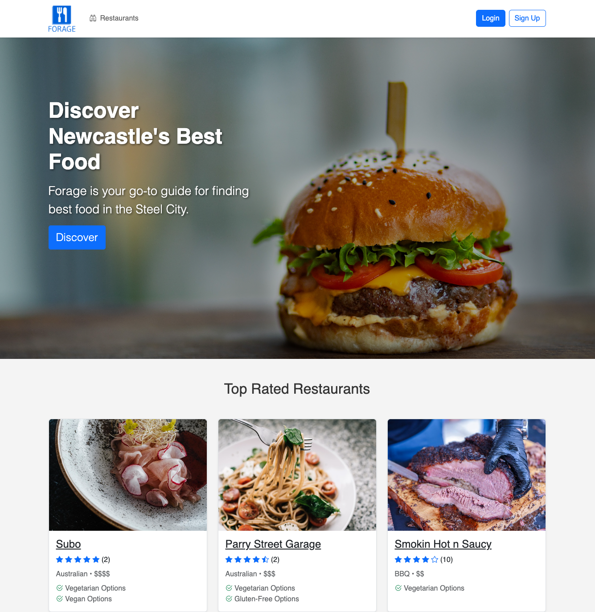
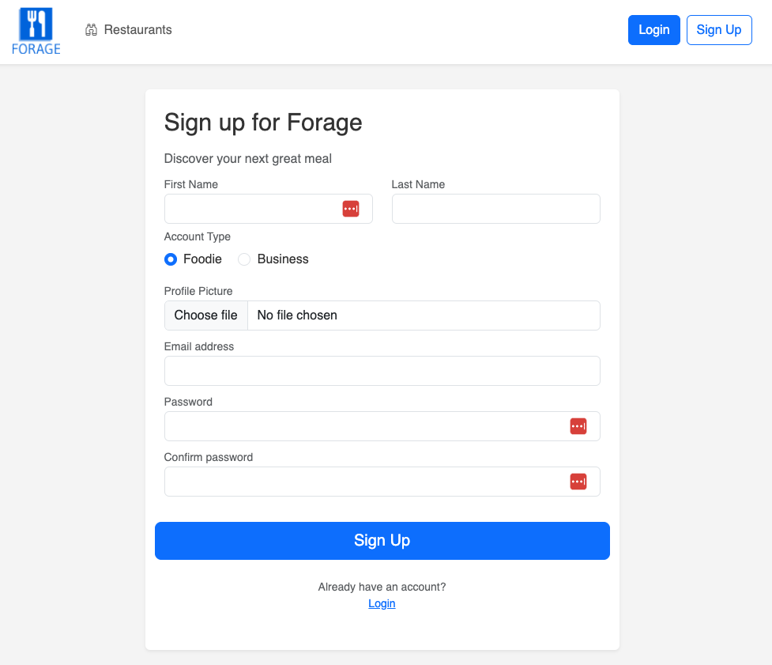
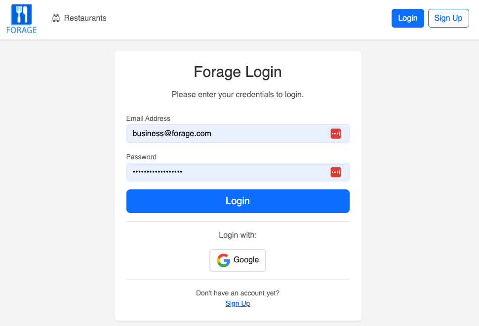
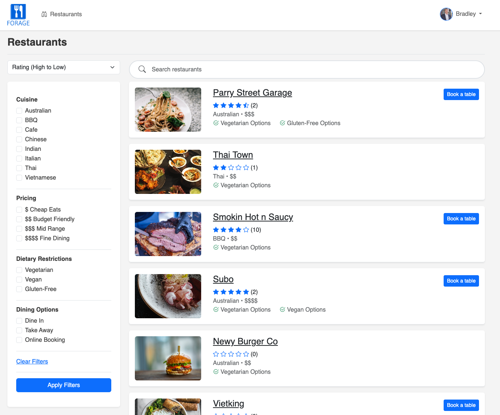
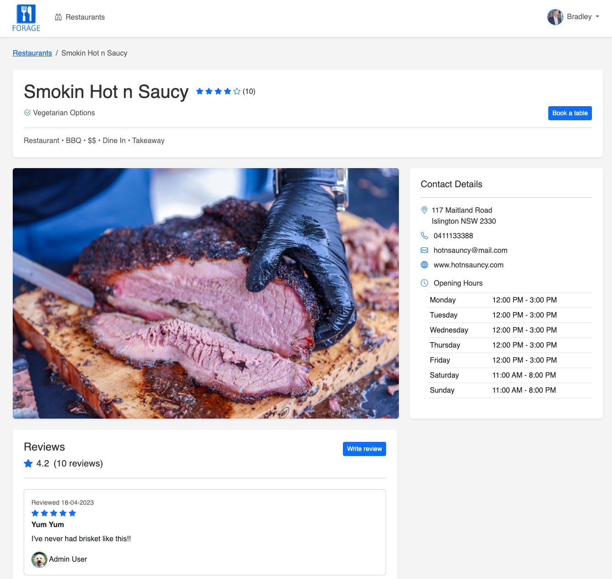
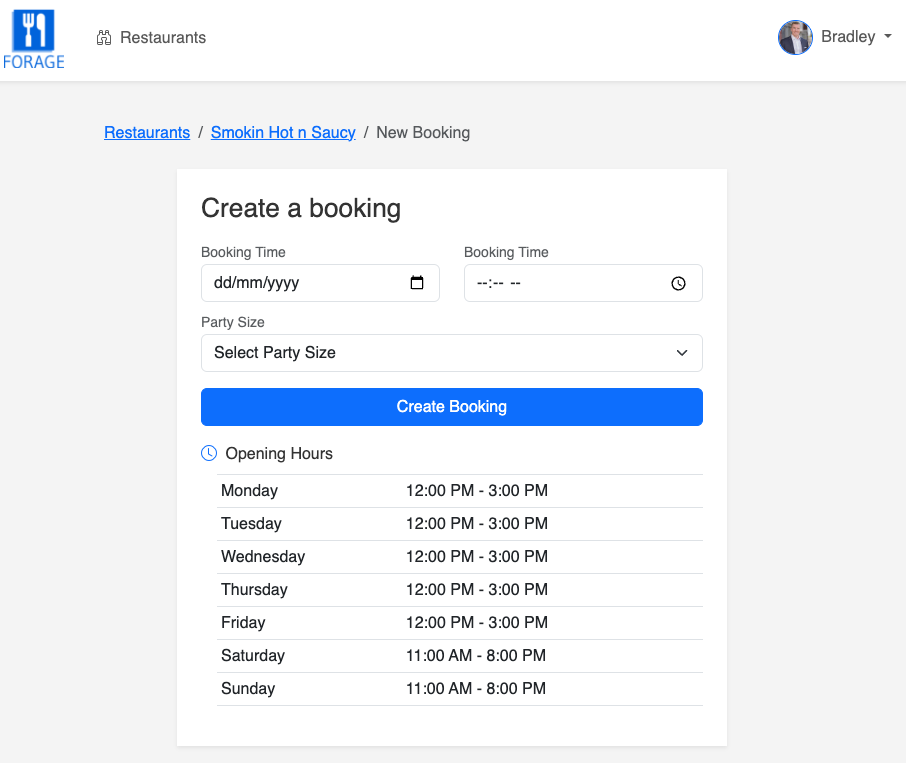
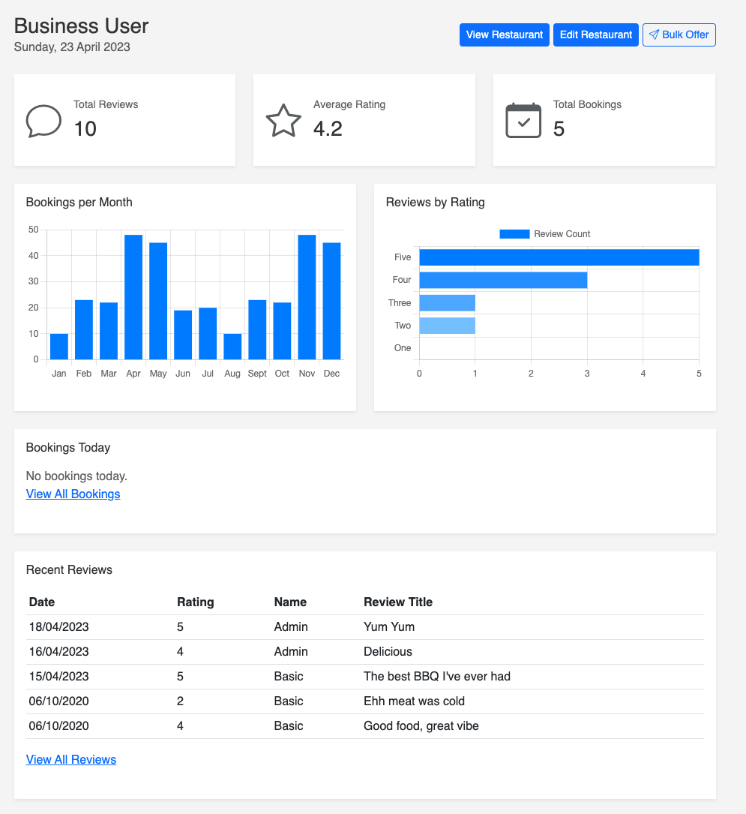
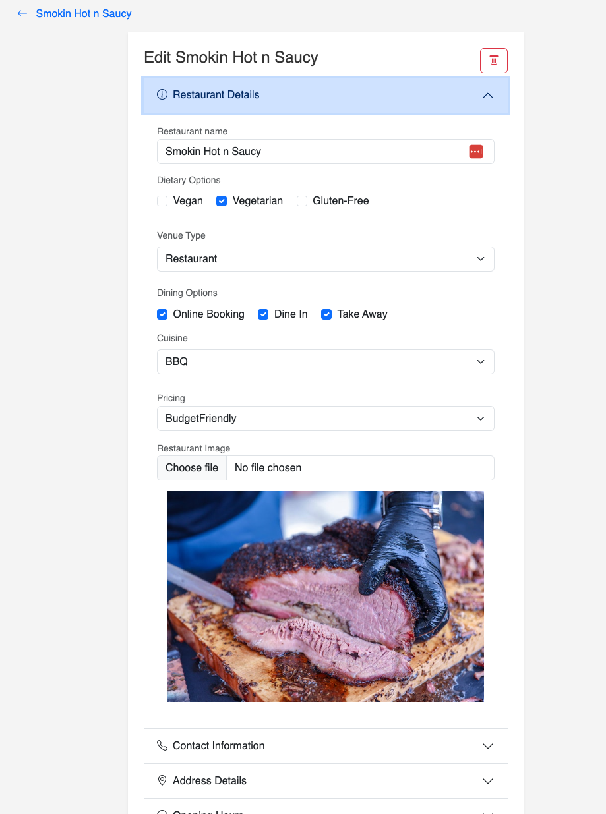
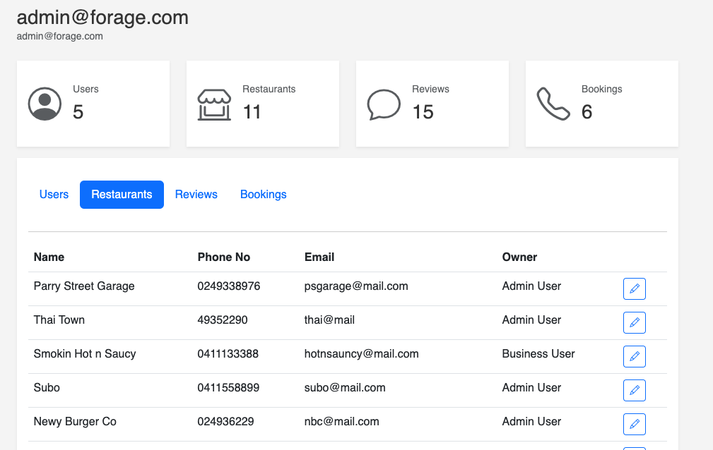

# Forage

## Fullstack restaurant discovery

### Description

Forage is a tripadvisor-style app for Restaurant's in Newcastle, Australia

### Features:

- Browse, filter, search and sort restaurants
- View restaurant details including contact information, dietary options and user reviews
- Leave your own review
- Book a table
- Create a business account, add your own restaurant and gain access to a personal dashboard

### Software Used

- HTML
- CSS
- Bootstrap
- Javascript
- ASP.NET Core
- Postgresql Database
- Cloudinary image storage
- Email with SendGrid
- Third Party authentication with Google

## Setup information

- Cloundinary, google authentication and SendGrid keys required in .env file

## Video Demonstration

https://youtu.be/fGNM8JmpIwQ

## Screenshots

### Landing Page

### Register & Login

### Restaurant Index

### Restaurant Detail

### Create Booking

### Business Dashboard

### Create/Edit Restaurant

### Admin Dashboard

